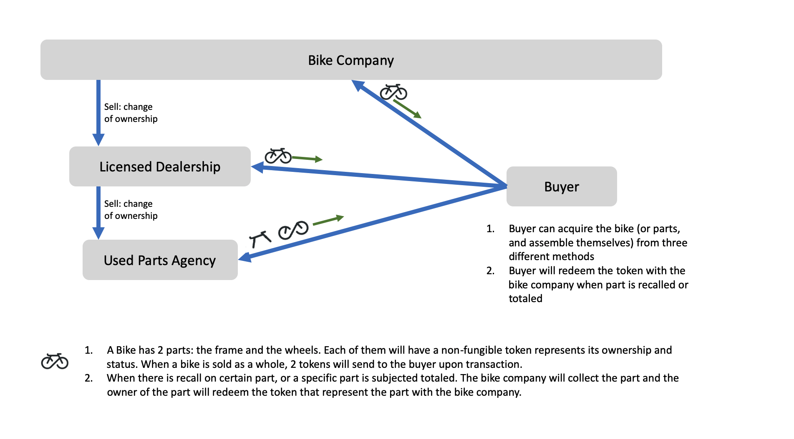

#set( $systemName = $display.capitalize( $aib.getParam( "corda.token-system-name" ) ) )
#set( $lowercaseSystemName = $display.uncapitalize( $systemName ) )
#set( $classes = $aib.getClassesToGenerate() )
#set( $numClasses = $classes.size() )
#set( $serialNumbers = [] )
#set( $firstClassName =  $display.uncapitalize( $classes.get(0).getName() ) )
#set( $classNames = [] )
#foreach( $class in $classes )
#set( $eatAddResponse = $classNames.add( $class.getName() ) )
#end##foreach( $class in $classes )

# ${systemName} Market - TokenSDK

## Introduction 
This Cordapp shows simple flows related to the token SDK. In this Cordapp, there are four standard parties: 
- The $systemName Company (${systemName}Co): can manufacture, sell, and recall/total the ${lowercaseSystemName}s(or parts). 
- The Licensed Dealership: Buy the ${lowercaseSystemName}s from the ${systemName}Co
- Used Parts Agency: Buy used parts from the Licensed Dealership(or end-buyers)
- Buyer: Buy ${lowercaseSystemName} from the ${systemName}Co or licensed dealer, or buy used parts from used parts agency. 

In this Cordapp, we will mimic a ${lowercaseSystemName} buying and selling market. 



From the above chart we see that Tokens are representing the ownership and status of the physical assets ( $classNames ). A key point to notice here is that **a ${lowercaseSystemName} is represented with $numClasses tokens (${classNames})**. This is designed in the way to be flexible to sell or total a specific part of your ${lowercaseSystemName}. As can see, this ${lowercaseSystemName} buying/selling market is capable of mimicking multiple business logics. We will be demonstrating one of the possible logic here:

1. ${systemName}Co manufactures the ${lowercaseSystemName}s
2. ${systemName}Co can sell the ${lowercaseSystemName} to licensed dealer and buyers. 
3. Used parts agency can get the used ${lowercaseSystemName} parts from the licensed dealer or buyers. 
4. When there is a need of total the physical ${lowercaseSystemName} part, the current of the physical part will redeem the token with the ${systemName}Co

Through out the app, you can see how to create, transact, and redeem a token. 

## Running the app
Deploy and run the nodes by:

```
./gradlew deployNodes
./build/nodes/runnodes
```
if you have any questions during setup, please go to https://docs.corda.net/getting-set-up.html for detailed setup instructions.

Once all ${numClasses} nodes are started up, in ${systemName}Co's node shell, run: 

```
#foreach( $class in $classes )
#set( $name = $class.getName() )
#set( $lowercaseName = $display.uncapitalize( $name ) )
#set( $serialNum = ${math.random(1000,9999)} )
#set( $eatAddResponse = $serialNumbers.add( ${serialNum} ) )
flow start Create${name}Token ${lowercaseName}Serial: $serialNum
#end##foreach( $class in $classes )
```
After this step, we have created $numClasses tokens representing the physical ${lowercaseSystemName} part with unique serial number(which will be unique in the manufacturing).
 
Then run:

```
#set( $flow = "flow start IssueNew${systemName} ")
#foreach( $class in $classes )
#set( $name = $class.getName() )
#set( $lowercaseName = $display.uncapitalize( $name ) )
#set( $index = ${velocityCount} - 1 )
#set( $serialNum = $serialNumbers.get( $index ) )
#set( $flow = "${flow} ${lowercaseName}Serial: ${serialNum}, " )
#end##foreach( $class in $classes )
#set( $flow = "${flow} holder: LicensedDealership" )
$flow
```

This line of command will transfer the ${numClasses} tokens together to represent a single ${lowercaseSystemName}) to the licensed dealer. 

Now, at the licensed dealer's shell, we can see we did receive the tokens by running: 

```
run vaultQuery contractStateType: com.r3.corda.lib.tokens.contracts.states.NonFungibleToken
```

Continue to the business flow, the licensed dealer will sell the ${lowercaseSystemName} to the Buyer. Run: 

```
#set( $flow = "flow start Transfer${systemName}Token ")
#foreach( $class in $classes )
#set( $name = $class.getName() )
#set( $lowercaseName = $display.uncapitalize( $name ) )
#set( $index = ${velocityCount} - 1 )
#set( $serialNum = $serialNumbers.get( $index ) )
#set( $flow = "${flow} ${lowercaseName}Serial: ${serialNum}, ")
#end##foreach( $class in $classes )
#set( $flow = "${flow} holder: Buyer" )
$flow
```

Now we can check at the Buyer's node shell to see if the buyer receives the token by running the same `vaultQuery` we just ran at the dealer's shell. 

At the Buyer side, we would assume we got a recall notice and will send the physical ${lowercaseSystemName} frame back to the manufacturer. The action will happen in real life, but on the ledger we will also need to "destroy"(process of redeem in Corda TokenSDK) the $firstClassName token. Run:

```
#set( $serialNum = $serialNumbers.get( 0 ) )
flow start TotalPart part: ${firstClassName}, serial: $serialNum
```

At the buyer's shell, if we do the [vaultQuery](https://docs.corda.net/docs/corda-os/api-vault-query.html#api-vault-query) again, we will see we now have all but the $firstClassName tokens. With the remaining tokens, we can sell the remaining parts to the used parts agency. We will achieve it by running: 

```
#foreach( $class in $classes )
#set( $flow = "flow start TransferPartToken part ")
#if ( $velocityCount > 1 )## skip the first one
#set( $name = $class.getName() )
#set( $lowercaseName = $display.uncapitalize( $name ) )
#set( $index = ${velocityCount} - 1 )
#set( $serialNum = $serialNumbers.get( $index ) )
#set( $flow = "${flow} ${lowercaseName}Serial: ${serialNum}, ")
#set( $flow = "${flow} holder: UsedPartsAgency" )
$flow
#end##if ( $velocityCount > 1 )## skip the first one
#end##foreach( $class in $classes )
```

At the end of the flow logic, we will find the $firstClassName token is destroyed and the used parts agency holds the remaining parts tokens. 


